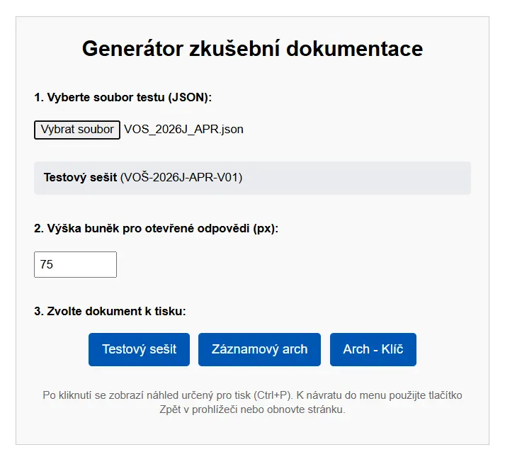
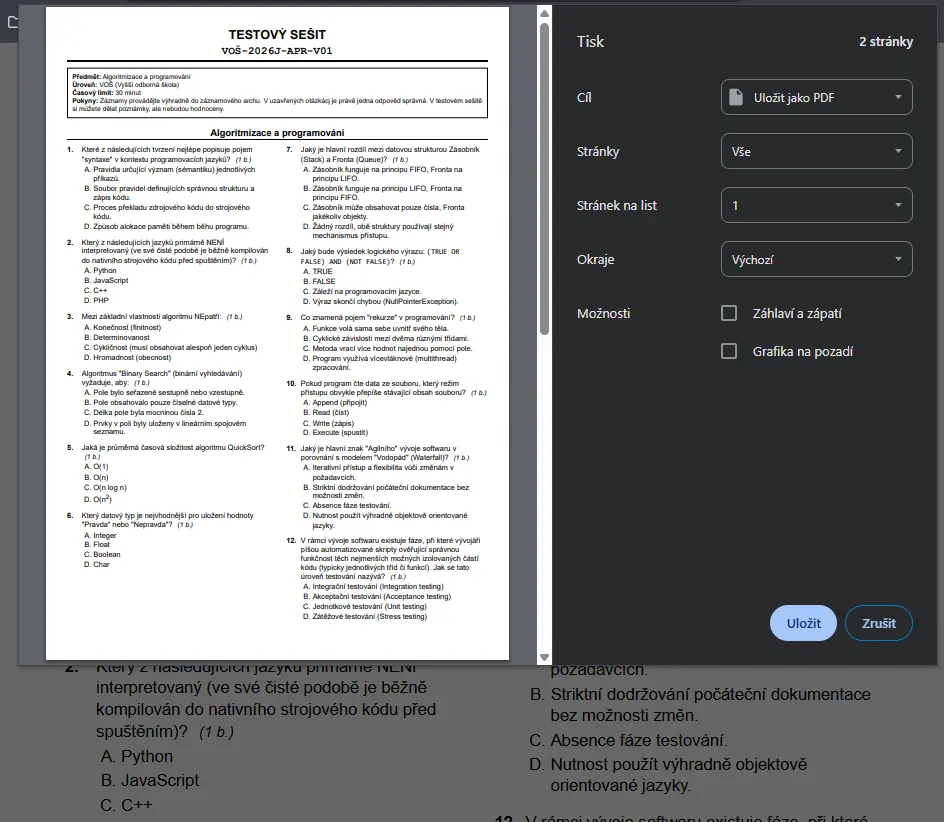
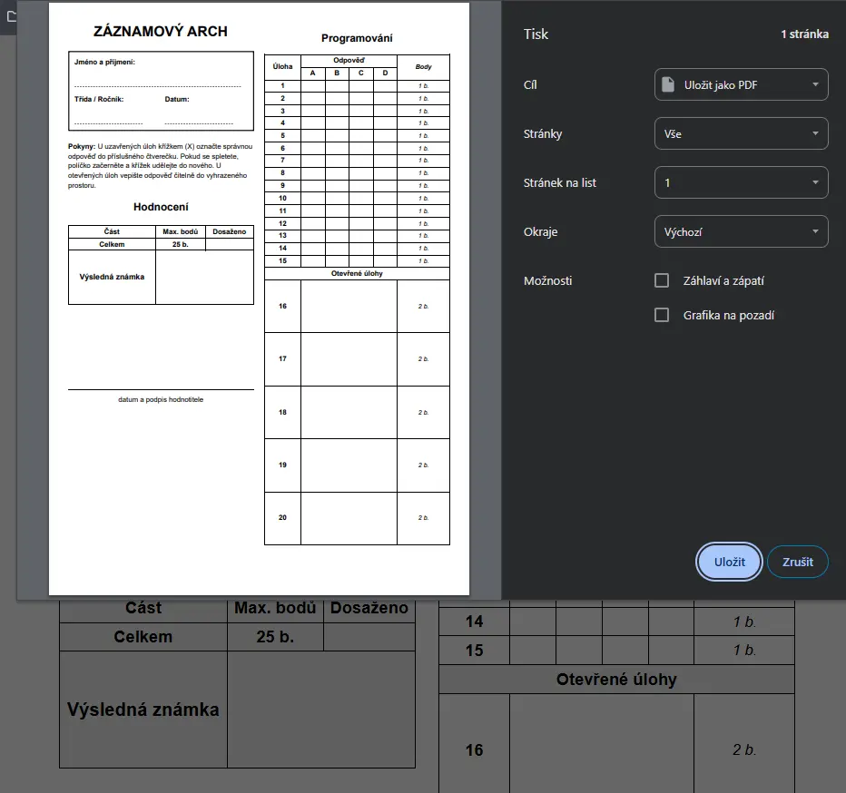
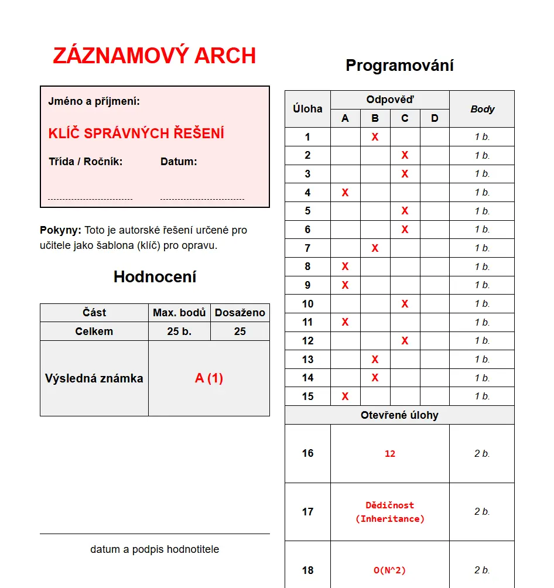

# Generátor zkušební dokumentace

Tato webová aplikace slouží k automatickému generování plně formátované zkušební dokumentace pro studenty z připravených dat. Aplikace funguje **kompletně offline** ve vašem webovém prohlížeči, nepotřebuje připojení k internetu ani žádný lokální server.

Dokáže z jednoho datového zdroje (souboru formátu JSON) vygenerovat hned 4 podoby dokumentu připravené pro tisk na papír (A4) nebo promítání:
1. **Testový sešit** – Zadání pro studenta, úvodní pokyny, dvousloupcový text se všemi otázkami.
2. **Testová prezentace** – Otázky zobrazené velkým písmem postupně po jedné na obrazovku, ideální pro přímé promítání žákům na tabuli.
3. **Záznamový arch** – Prázdná matice (tabulka) pro odpovědi studenta, tabulka hodnocení, prostor pro otevřené odpovědi a podpisy hodnotitelů.
4. **Záznamový arch - Klíč** – Autorské řešení s červeně vyznačenými správnými odpověďmi a výpočtem maximálních bodů, které slouží učiteli jako šablona k rychlé opravě.

---

## Jak aplikaci spustit a používat

1. Otevřete soubor `index.html` ve vašem oblíbeném webovém prohlížeči (Chrome, Firefox, Edge, Safari...).
2. V sekci **1. Vyberte soubor testu (JSON)** klikněte na tlačítko pro výběr souboru a najděte ve vašem počítači (např. ve složce `data/`) předpřipravený `.json` soubor s testem.
3. V sekci **2. Výška buněk pro otevřené odpovědi** můžete v pixelech upravit, jak velký prostor dostanou studenti pro zapsání odpovědí u otevřených otázek (výchozí je 75px, lze upravovat po 5px).
4. V sekci **3. Zvolte dokument k tisku** vyberte, kterou sestavu chcete zrovna vytisknout.
5. Zobrazí se náhled dokumentu. Klávesovou zkratkou **Ctrl + P** (nebo Cmd + P na Macu) vyvoláte dialog tisku vašeho prohlížeče. Ovládací prvky ani tlačítka se na papír nevytisknou, tiskové CSS zajistí správné zalamování stránek a okrajů.
6. Pro návrat zpět do menu a tisk další sestavy klikněte na červené tlačítko "Zpět do menu" umístěné pod testem (případně zmáčkněte klávesu F5 pro obnovení stránky).

---

## Tvorba nových testů (Struktura JSON)

Testy jsou uloženy ve formátu **JSON** (JavaScript Object Notation). Jde o strukturovaný textový soubor, který můžete psát v libovolném textovém editoru (např. Poznámkový blok, VS Code, Notepad++). Doporučujeme vždy zkopírovat existující funkční test a pouze přepsat jeho hodnoty.

### Příklad a popis struktury

```json
{
    "code": "Kód testu (např. VOŠ-2026J-APR)",
    "title": "Hlavní název dokumentu (např. Testový sešit)",
    "subject": "Název vyučovaného předmětu",
    "level": "Cílová skupina (např. VOŠ)",
    "timeLimit": "Časový limit (např. 90 minut)",
    "instructions": "Zde napište veškeré pokyny pro studenty, které se zobrazí na začátku sešitu.",
    "parts": [
        {
            "title": "Celý název 1. kapitoly/části",
            "shortTitle": "Krátký název (zobrazí se v úzkých tabulkách)",
            "closedQuestions": [
                {
                    "points": 1,
                    "text": "Text první uzavřené otázky?",
                    "options": [
                        "Možnost A",
                        "Možnost B",
                        "Možnost C",
                        "Možnost D"
                    ],
                    "correctAnswer": "A"
                }
            ],
            "openQuestions": [
                {
                    "points": 2,
                    "text": "Text otevřené otázky (můžete použít i HTML značky jako <code> nebo <br>)?",
                    "correctAnswer": "Vzorová správná odpověď pro klíč"
                }
            ]
        }
    ]
}
```

### Důležitá pravidla pro tvorbu JSON dat
- **Části testu (`parts`)**: Test se může skládat z jedné nebo více kapitol (parts). 
  - *Pokud vložíte jen jednu část*, její název se nevypíše s předponou "Část 1:" a v záznamovém archu se přeskočí zbytečné řádkování v tabulce celkového hodnocení.
  - *Pokud je částí více*, tabulky i nadpisy se automaticky rozdělí, číslují a hodnotí zvlášť.
- **Uzavřené otázky (`closedQuestions`)**: Vždy nabídněte přesně 4 možnosti (`options`), jelikož záznamový arch je koncipován na ABCD matici. Správná odpověď (`correctAnswer`) je vždy jen jedno písmeno, např. `"A"`. Počet bodů můžete libovolně měnit pomocí klíče `"points"`.
- **Otevřené otázky (`openQuestions`)**: Studenti nemají na výběr z možností, odpovídají textem/výpočtem. Můžete zde využít jednoduché HTML značky (např. `<code>` pro označení zdrojového kódu nebo `<br>` pro odřádkování).
- **Body (`points`)**: Můžete zadávat libovolná čísla u každé jedné otázky. Generátor automaticky sečte maxima pro jednotlivé části i celkovou známku do záznamového archu.
- **Typografie**: Generátor sám prochází test a k předložkám i spojkám (v, k, s, z, o, u, a, i) automaticky přidává tzv. pevné mezery, aby tyto znaky nezůstávaly viset na konci řádku při tisku. Vy se tím tedy při psaní testu nemusíte trápit.
- **Zápis textu s uvozovkami**: Pokud potřebujete přímo uvnitř textu otázky použít uvozovky, musíte je takzvaně "escapovat" zpětným lomítkem. Příklad: `"text": "Slovo \"syntaxe\" znamená..."`

Při tvorbě vlastních JSON souborů si dejte dobrý pozor na čárky oddělující vlastnosti a objekty. Chybějící (nebo přebývající) čárka na konci řádku je nejčastější příčinou toho, že soubor nelze načíst! Můžete si pomoci nástrojem [JSONLint](https://jsonlint.com/) k ověření validity vašeho kódu.

## Náhledy z aplikace

- *Domovská stránka s výběrem sestavy testu k tisku:*

  

- *Generovaný testový sešit určený k tisku:*

  

- *Generovaný záznamový arch určený k tisku:*

  

- *Generovaný záznamový arch s ukázkou správných odpovědí:*

  


## Licence

Tento projekt je licencován pod licencí MIT.